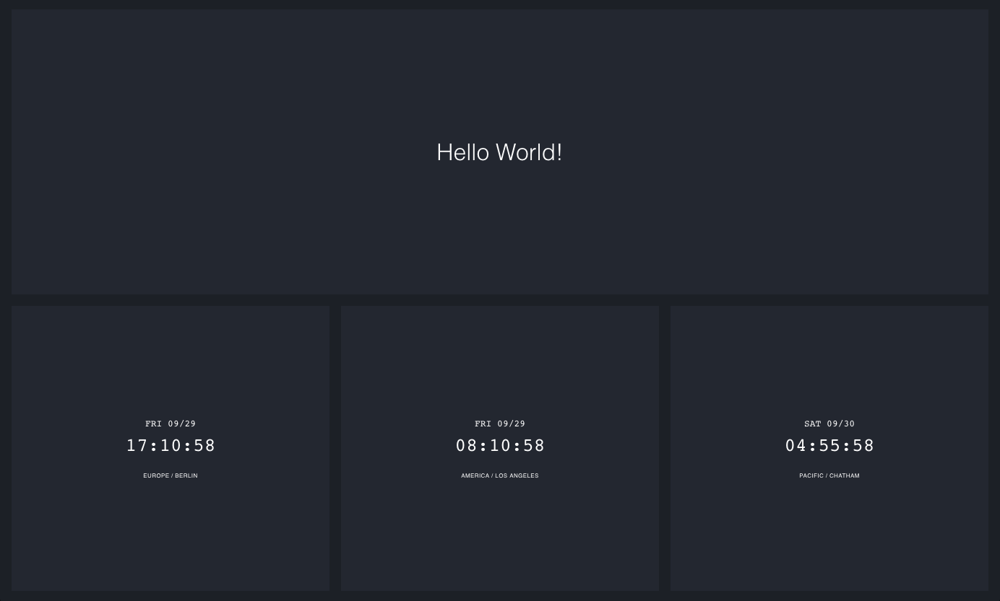

**Not finished yet. Do not use in production**

A Vue component to build a CSS Grid Dashboard
===
This simple package provides two components to create a simple grid to create a dashboard. This package is inspired by the awesome [dashboard project created by Spatie](https://github.com/spatie/dashboard.spatie.be).

But instead of providing a complete project this package aims to provide you some components that you can use to integrate in your own projects.



Installation
---

Simply add this package using npm/yarn

```bash
# using yarn
yarn add aheenam-vue-dashboard

# using npm
npm i -S aheenam-vue-dashboard
```

Usage
---

This package includes two components: `dashboard` and `tile`. While `dashboard` serves as the container for the grid system, `tile` is the child component that should be used for the `dashboard`.

### The `dashboard` component

The dashboard component needs two parameter defining the size of the grid.

```html
<dashboard :rows="4" :columns="4">
</dashboard>
```

The `rows` property defaults to `3` and the `columns` property has 5 as its default. That means

```html
<dashboard></dashboard>
```

will create a grid with 3 rows and 5 columns.

### The `tile` component

This component is in charge of building the grids in this dashboard. Using the properties you can position and size them.

```html
<dashboard  :rows="4" :columns="4">
  <tile :x="1" :y="1" :w="4" :h="1">
    Hello World!
  </tile>
</dashboard>
```

Above example create a dashboard with 4 rows and 4 columns and adds a tile that spans over the whole first row.

`x` & `y` and the coordinates where to start the tile and `w` and `h` represent the width and height of the tile.

#### Styling

There is no styling applied to this elements. The only CSS that is used is the use of CSS Grid System. All the others styles is meant to applied by yourself by adding class and style bindings to the elements.

## Content of the tiles

What about the dashboard contents? It is up to you what you want to display in these tiles. It can be some plain text as shown in the example but also be some complex component that you or someone in the community created.

In the future we will share some components that we built for ourself.

Take this clock component for example:

```html
<template>
  <div class="clock">
    <div class="date">
      {{ dateTime.format('ddd MM/DD') }}
    </div>
    <div class="time">
      {{ dateTime.format('HH:mm:ss') }}
    </div>
    <div class="timezone">
      {{ timezone.replace('_', ' ').replace('/', ' / ') }}
    </div>
  </div>
</template>

<script>
import moment from 'moment-timezone'

export default {
  name: 'clock',
  props: {
    timezone: {
      type: String,
      default: 'Europe/Berlin'
    }
  },
  data () {
    return {
      dateTime: moment().tz(this.timezone)
    }
  },
  created () {
    this.dateTime = moment.tz(this.timezone)
    this.tick()
  },
  methods: {
    tick () {
      setInterval(() => {
        this.dateTime = moment().tz(this.timezone)
      }, 1000)
    }
  }
}
</script>

<style>
.clock {
  font-size: 1rem;
  display: flex;
  flex-direction: column;
  justify-content: center;
  align-content: center;
  align-items: center;
  height: 100%;
}

.timezone {
  display: block;
  font-size: 0.5em;
  letter-spacing: 0.05em;
  text-transform: uppercase;
  margin-top: 3em;
}

.date {
  font-size: 1em;
  font-family: monospace;
  text-transform: uppercase;
  margin-bottom: 0.5em;
}

.time {
  font-size: 2em;
  font-family: monospace;
}
</style>

```

You can add this clock just by adding it to your project and add it in the tile

```html
<dashboard  :rows="4" :columns="4">
  <tile :x="1" :y="1" :w="4" :h="1">
    <clock timezone="Europe/Berlin" />>
  </tile>
</dashboard>
```
